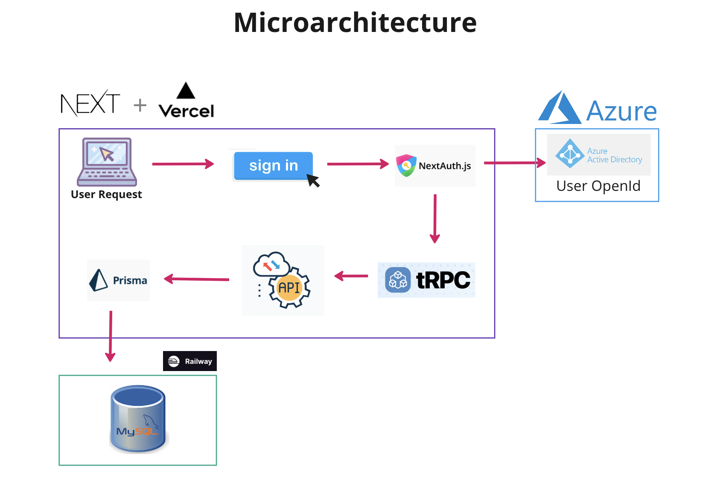

<h1 align="center">
The Chiron Project
</h1>

### Summary

The Chiron Project is a platform designed to help organisations build mentorship networks, thus enabling employees to exchange knowledge, advice, and support to accelerate both personal and professional capabilities.

Often, mentorships within companies occur unintentionally without a formal program. Our platform aims to bridge this gap. This is essential; in the modern workplace, mentorships across all disciplines play an integral role in an employee’s development, even more so now with the current financial crisis and hybrid working model.

Our user friendly & accessible prototype ensures that a user can search for potential mentors, view their profile page, send requests, and even become a mentor themself, passing their own unique experience forwards.

<h2>
References
</h2>

This is Version 2 of The Chiron Project. You can find V1 [here](https://github.com/DanaMurali/The_Chiron_Project).

This is a [T3 Stack](https://create.t3.gg/) project bootstrapped with `create-t3-app`.
